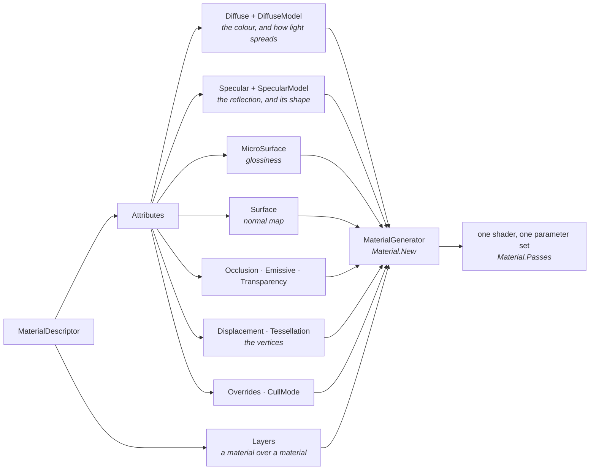
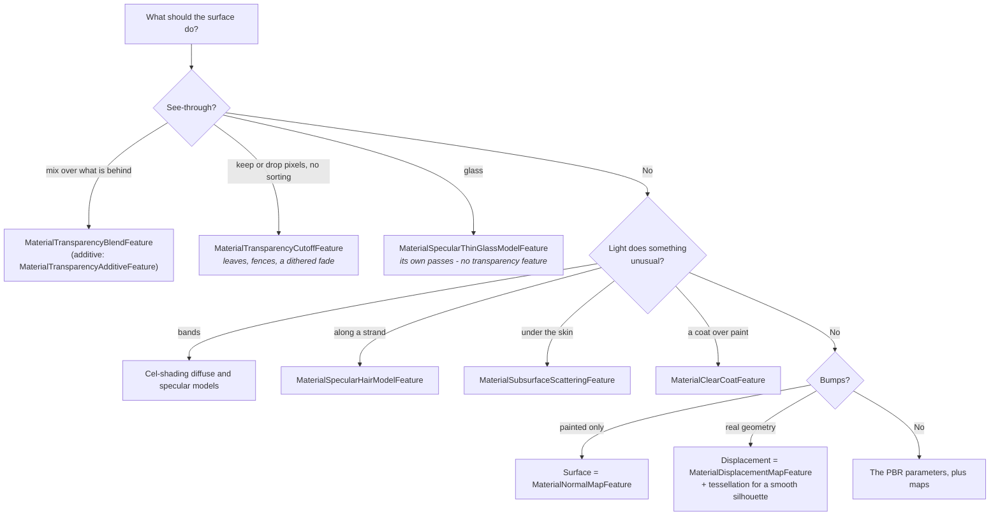

# Materials from code

A material in Stride is a `MaterialDescriptor`: a set of feature objects that the engine compiles into a
shader. Game Studio saves descriptors as assets. In a code-only project you build them in C#. This article
describes the descriptor, the toolkit helpers that create common materials, and how to change materials at
runtime.

The code samples come from this repository. Most are from the
[Material Gallery](../code-only/examples/material-gallery.md) example (`E02_3D_Material_Gallery`), which shows
each feature on its own station.

## How a material is built

A `MaterialDescriptor` has an `Attributes` object with one slot per aspect of a surface, and a `Layers` list.
Each slot takes a feature. `Material.New` runs the material generator, which composes the features into one
shader.



- A slot you leave empty adds no code to the shader. A material without a `Surface` feature does no
  tangent-space work. A material without a `Specular` feature has no highlight and no reflection.
- A slot and its model are separate choices. `Diffuse` sets the colour and `DiffuseModel` sets how light
  spreads (Lambert, cel shading, hair). `Specular` sets how reflective the surface is and `SpecularModel` sets
  the shape of the reflection (microfacet, thin glass, cel shading, hair).

## Create a material

### Helper methods

The helpers are extension methods on `Game`.

| Method | Result |
|---|---|
| `CreateMaterial(color, metalness, glossiness)` | A lit PBR material. Defaults: metalness 0, glossiness 0.65 |
| `CreateFlatMaterial(color)` | An unlit colour, for 2D shapes and HUD elements |
| `CreateEmissiveMaterial(color, intensity)` | A lit colour that also emits light. An intensity above 1 blooms under post effects |
| `CreateTexturedMaterial(texture, metalness, glossiness, tiling)` | A PBR material with a texture as its colour |
| `CreateScreenMaterial(texture)` | An unlit, clamped texture, for a monitor that shows a render-texture feed |
| `CreateOverlayMaterial(color, intensity)` | An unlit translucent colour, with the colour's alpha as the opacity: a zone, a placement preview, a marker over the scene |
| `CreateMaterial(descriptor)` | Compiles any descriptor and keeps it on `Material.Descriptor` |

### Descriptors

`MaterialDescriptors` in `Stride.CommunityToolkit.Rendering` returns the descriptor behind each helper: `Pbr`,
`Textured`, `Emissive`, `Screen`, `Flat`, `Overlay` and `Highlight`. To extend a helper's material, take its descriptor,
add or replace a feature, and compile it.

```csharp
var descriptor = MaterialDescriptors.Textured(brick, glossiness: 0.4f);

descriptor.Attributes.Surface = new MaterialNormalMapFeature(new ComputeTextureColor(brickNormal)) { ScaleAndBias = true, IsXYNormal = true };

var material = game.CreateMaterial(descriptor);
```

> [!IMPORTANT]
> Compile descriptors with `game.CreateMaterial(descriptor)` or `Material.New(device, descriptor, game.Content)`.
> The microfacet specular model reads an environment lookup texture that ships with the engine as an asset.
> Without the content manager the texture is not resolved and metals render black. No exception is thrown.

When no content manager is available, such as in a tool or a test, use the polynomial environment term, which
needs no asset:

```csharp
new MaterialSpecularMicrofacetModelFeature { Environment = new MaterialSpecularMicrofacetEnvironmentGGXPolynomial() }
```

## PBR parameters

A physically based (PBR) material describes what a surface is made of, and the lighting is computed from that.
In Stride's metalness workflow the description is a colour, a glossiness and a metalness, under the microfacet
specular model.

```csharp
// src/Stride.CommunityToolkit/Rendering/MaterialDescriptors.cs
public static MaterialDescriptor Pbr(Color colour, float metalness = 0f, float glossiness = DefaultGlossiness) => new()
{
    Attributes =
    {
        Diffuse = new MaterialDiffuseMapFeature(new ComputeColor(colour)),
        DiffuseModel = new MaterialDiffuseLambertModelFeature(),
        MicroSurface = new MaterialGlossinessMapFeature(new ComputeFloat(glossiness)),
        Specular = new MaterialMetalnessMapFeature(new ComputeFloat(metalness)),
        SpecularModel = Microfacet(),
    },
};
```

| Parameter | 0 | 1 | Values in between |
|---|---|---|---|
| Glossiness | Rough. The highlight is a haze and reflections are blurred | Mirror. The highlight is a point and reflections are sharp | Most real surfaces. A glossiness map sets it per texel |
| Metalness | Dielectric. Keeps its colour as diffuse and reflects about 2 % without tint | Metal. Has no diffuse colour. Its colour tints the reflection | Transitions only, such as paint over bare metal |

Both values are clamped to the range 0 to 1.

> [!NOTE]
> A metal has no diffuse colour. It shows a tinted reflection of its environment, so it is dark when the scene
> has no skybox or the skybox light is dim.

The specular workflow is the alternative to metalness. `MaterialSpecularMapFeature` sets the reflection colour
directly. Game Studio's Material Package uses this workflow.

The microfacet model also has a normal distribution function (GGX, Beckmann or Blinn-Phong) and a Fresnel
term. Glossiness 1, metalness 1 and `MaterialSpecularMicrofacetFresnelNone` give a mirror.

## Material nodes

Every slot takes a node. A constant is the simplest node.

| Node | Input | Gallery station |
|---|---|---|
| `ComputeColor`, `ComputeFloat` | A constant | Glossiness sweep, Metalness sweep |
| `ComputeTextureColor`, `ComputeTextureScalar` | A texture, with scale and offset | Albedo texture, Gloss and metal maps |
| `ComputeVertexStreamColor` | A colour per vertex, from the mesh | Vertex colours |
| `ComputeBinaryColor` | Two child nodes combined by an operator | Node arithmetic |
| `ComputeShaderClassColor` | A shader class, referenced by name | Custom shader node |

### Texture node options

`ComputeTextureColor` and `ComputeTextureScalar` share these options.

| Property | Default | Effect |
|---|---|---|
| `Scale`, `Offset` | 1, 0 | Tiles and shifts the texture |
| `TexcoordIndex` | `Texcoord0` | The texture coordinate set of the mesh, up to `Texcoord9` |
| `AddressModeU`, `AddressModeV` | `Wrap` | What is sampled outside 0 to 1 |
| `UseRandomTextureCoordinates` | `false` | Breaks up the repetition of a tiled texture |
| `FallbackValue` | White, or 1 | What the node gives when `Texture` is `null` |
| `Swizzle` (colour only) | `"rgba"` | The channels the node reads, in order. `"bgra"` swaps red and blue |
| `Channel` (scalar only) | `R` | The channel the scalar is read from |

One packed texture can feed several slots through `Channel`.

```csharp
// examples/code-only/E02_3D_Material_Gallery/Stations.Maps.cs
var ironMaps = t.Packed("iron-gloss-metal", "iron_blend/iron/iron_gls.png", "iron_blend/iron/iron_mtl.png");

glossiness: Recipes.Scalar(ironMaps, channel: ColorChannel.R),
metalness: Recipes.Scalar(ironMaps, channel: ColorChannel.G)
```

> [!NOTE]
> A node that has no texture when the material is generated compiles to its fallback value. The shader then has
> no texture slot, so setting the texture key later has no effect. Give the node a texture before you
> generate the material.

### Operators

`ComputeBinaryColor` combines two nodes by a `BinaryOperator`.

| Operator | Result |
|---|---|
| `Add` | The second colour composited over the first by its alpha, as an Add layer in a paint program. A colour at half alpha adds half of itself |
| `AddMath` | The sum of the two colours, alpha included |
| `Multiply`, `Average`, `Overlay`, `Screen`, `Difference`, `Desaturate` and others | As in a paint program |

Use `AddMath` for arithmetic.

`ComputeFloat4` passes its value to the shader unchanged: no colour space conversion and no premultiplied
alpha. `ComputeColor` converts and premultiplies.

### Custom shader node

A shader class that derives from `ComputeColor` and overrides `Compute()` can fill any slot.

```hlsl
// examples/code-only/E02_3D_Material_Gallery/Effects/GalleryChecker.sdsl
shader GalleryChecker : ComputeColor, Texturing
{
    override float4 Compute()
    {
        float2 cell = floor(streams.TexCoord * 6.0);
        float odd = fmod(cell.x + cell.y, 2.0);

        return lerp(float4(0.92, 0.90, 0.84, 1.0), float4(0.16, 0.18, 0.22, 1.0), odd);
    }
};
```

```csharp
// examples/code-only/E02_3D_Material_Gallery/Stations.Inputs.cs
s.PlaceTrio(s.Material(Recipes.Mapped(new ComputeShaderClassColor { MixinReference = "GalleryChecker" }, glossiness: new ComputeFloat(0.45f))));
```

Place the `.sdsl` file in the project's `Effects` folder. The asset compiler builds it with the project. For
shaders in a library, see [Shaders in a toolkit package](../../contributing/toolkit/shaders.md).

## Load textures

Game Studio's content pipeline prepares a texture at import according to its type. `Texture.Load(device, stream)`
with its default arguments does not: it loads every file as linear, with straight alpha and one mip level.
`TextureLoader` prepares a texture at runtime according to its role.

```csharp
var textures = new TextureLoader(game.GraphicsDevice, "Resources/materials");

var albedo = textures.Color("brick/brick_dif.png");
var gloss = textures.Data("brick/brick_gls.png");
var normal = textures.NormalMap("brick/brick_nml.png");
```

| Method | Colour space | Alpha | Mipmaps |
|---|---|---|---|
| `Color(path)` | sRGB | Premultiplied in linear light | Averaged in linear light |
| `Data(path)` | Linear | Unchanged | Averaged |
| `NormalMap(path, invertY)` | Linear | Unchanged | Averaged and renormalised |

A loader keeps each texture per path and disposes them when it is disposed. The static methods return a
texture that the caller owns.

| Method | Use |
|---|---|
| `Load(path, options)` | A file, with every option set through `TextureLoadOptions` |
| `TextureLoader.Load(device, stream, options)` | A stream |
| `TextureLoader.FromImage(device, image, options)` | A decoded `Image`, after you edit its pixels |
| `TextureLoader.FromPixels(device, pixels, width, height, options)` | Pixels computed in code |

`TextureLoadOptions` has three switches: `PremultiplyAlpha` (colour textures, default on), `InvertY` (normal
maps, default off) and `GenerateMipmaps` (default on). `TexturePixels` exposes the pixel operations.

### Symptoms of a texture loaded in the wrong role

The **Texture loading** station shows each case beside the correct result.

| Symptom | Cause | Fix |
|---|---|---|
| Colours are pale | A colour texture loaded as linear | `Color(path)` |
| Normal-mapped detail looks flattened | A normal map loaded as sRGB | `NormalMap(path)` |
| Bumps are lit as dents | The normal map's green channel uses the other convention | `NormalMap(path, invertY: true)` |
| A white or coloured fringe around transparent areas | Straight alpha | `Color(path)` premultiplies |
| Shimmer on tiled or distant surfaces | No mipmaps | The loader builds them |

### Normal map convention

Stride's tangent space uses the DirectX convention: the green channel points down the texture. The Material
Package's normal maps use this convention. Maps from Blender, Unity and glTF use the OpenGL convention, with
green pointing up. Load those with `invertY: true`.

> [!NOTE]
> Game Studio's normal map import inverts the green channel by default. `TextureLoader` does not. Check a
> material in the **Normal (world)** stream view if the lighting looks inverted.

The Material Package's normal maps store X and Y in the range 0 to 1 and leave Z to be rebuilt. Set both
switches on the feature:

```csharp
new MaterialNormalMapFeature(normal) { ScaleAndBias = true, IsXYNormal = true }
```

### Limitations

- Textures are not block compressed. They use 8 bits per channel, which takes four to eight times the memory of
  a BC format.
- The loader prepares 2D images in 8-bit RGBA or BGRA. Other formats throw `NotSupportedException`.
- A `.dds` file is loaded as it is. Only its colour space is set by the role. Use `.dds` for compressed
  textures and for mipmaps built offline.

## Change parameters at runtime

A compiled material is a shader and a set of parameters. To change a value, set its parameter. The material
is not rebuilt.

`MaterialParameters` provides extension methods on `Material`.

| Method | Description |
|---|---|
| `Set(key, value)` | Sets a value or an object parameter on every pass |
| `SetColor(key, colour, premultiply)` | Sets a colour, converted to linear and premultiplied by alpha |
| `SetTextureOffset(offset, textureIndex)` | Sets the offset of a texture node |
| `SetTextureScale(scale, textureIndex)` | Sets the tiling of a texture node |
| `ColorKey(name)`, `FloatKey(name)`, `TextureKey(name)` | Creates a named key to assign to a node |
| `ToMaterialValue(colour, premultiply)` | Returns the converted colour without setting it |
| `TextureKeyAt(key, textureIndex)` | Returns the key of the nth texture node |

A constant in a slot registers under the slot's key in `MaterialKeys`, for example `GlossinessValue`,
`MetalnessValue` and `EmissiveIntensity`. To address a specific node, assign it a key of your own.

```csharp
// examples/code-only/E02_3D_Material_Gallery/Stations.Maps.cs
private static readonly ValueParameterKey<Color4> TintKey = MaterialParameters.ColorKey("MaterialGallery.Tint");

var tint = s.Material(Recipes.Mapped(new ComputeColor(Color.White) { Key = TintKey }, glossiness: new ComputeFloat(0.6f)));
...
state.Tint.SetColor(TintKey, new ColorHSV(hue, 0.7f, 1f, 1f).ToColor());
state.Scroll.SetTextureOffset(new Vector2(s.Seconds * 0.15f, 0f));
state.Gloss.Set(MaterialKeys.GlossinessValue, 0.5f + 0.5f * MathF.Sin(s.Seconds));
```

Remarks:

- The material generator converts a colour node's value to linear and premultiplies it by alpha. `SetColor`
  applies the same conversion, so a runtime value matches a compiled one.
- A material can have several passes, each with its own parameters. Clear coat has two, hair has three and thin
  glass has two or four. The setters write to every pass. `material.Passes[0].Parameters.Set` writes to one.
- Every texture node registers a scale and an offset. The first texture uses `MaterialKeys.TextureScale` and
  `MaterialKeys.TextureOffset`. Later textures use the same keys composed with `i1`, `i2` and so on.
- The parameters of your own shader are set the same way, through the key class that the shader source
  generator creates.

## Swap materials at runtime

A material can be assigned in two places. The engine reads both every frame.

| Location | Affects | Assign | Restore |
|---|---|---|---|
| `modelComponent.Materials[slot]` | One entity | `component.Materials[0] = red` | `component.Materials.Remove(0)` |
| `model.Materials[slot].Material` | Every entity that draws the model | `model.Materials[0].Material = blue` | Assign the previous material |

The component's entry takes precedence. Without one, the model's material is used.

> [!WARNING]
> A `Model` is shared by every entity that draws it. Changing `model.Materials` changes all of them.

Remarks:

- A change takes effect on the next frame. The engine rebuilds the entity's render meshes only when the new
  material has a different number of passes.
- A slot casts a shadow when both `modelComponent.IsShadowCaster` and `model.Materials[slot].IsShadowCaster`
  are true. Only the model has a flag per slot.
- `material.Passes[n].CullMode` and `DepthFunction` are pipeline state. A change needs no shader compile and
  affects every entity that uses the material.
- A compiled material cannot be regenerated in place. Keep the descriptor, change it, compile it again and
  assign the new material. If only constants changed, the effect is already compiled.

The **Materials at runtime** station shows each case on three entities that share one model.

## Write a custom material feature

A node supplies the value of one slot. A feature adds shader code to a stage. Write a feature to move vertices,
discard pixels or add a shading term.

A feature is a class that derives from `MaterialFeature` and implements the interface of the slot it goes in.

```csharp
// examples/code-only/E02_3D_Material_Gallery/CustomFeatures.cs
[DataContract]
public class WobbleFeature : MaterialFeature, IMaterialDisplacementFeature
{
    public float Amplitude { get; set; } = 0.08f;
    public float Frequency { get; set; } = 7f;
    public float Speed { get; set; } = 4f;

    public override void GenerateShader(MaterialGeneratorContext context)
    {
        context.SetStreamFinalModifier<WobbleFeature>(MaterialShaderStage.Vertex, new ShaderClassSource("GalleryWobble"));

        var parameters = context.MaterialPass.Parameters;

        parameters.Set(GalleryWobbleKeys.WobbleAmplitude, Amplitude);
        parameters.Set(GalleryWobbleKeys.WobbleFrequency, Frequency);
        parameters.Set(GalleryWobbleKeys.WobbleSpeed, Speed);
    }
}
```

```hlsl
// examples/code-only/E02_3D_Material_Gallery/Effects/GalleryWobble.sdsl
shader GalleryWobble : IMaterialSurface, PositionStream, NormalStream
{
    cbuffer PerMaterial
    {
        stage float WobbleAmplitude;
        stage float WobbleFrequency;
        stage float WobbleSpeed;
    }

    override void Compute()
    {
        float wave = sin(streams.Position.y * WobbleFrequency - Global.Time * WobbleSpeed);

        streams.Position = float4(streams.Position.xyz + streams.meshNormal * (wave * WobbleAmplitude), streams.Position.w);
    }
};
```

Assign the feature to its slot:

```csharp
descriptor.Attributes.Displacement = new WobbleFeature();
```

### Generator context methods

| Member | Description |
|---|---|
| `AddShaderSource(stage, shader)` | Adds a surface shader to a stage, in slot order |
| `SetStreamFinalModifier<T>(stage, shader)` | Sets a shader that runs last in its stage |
| `AddFinalCallback(stage, callback)` | Runs a callback after all features have generated |
| `AddShading(feature)` | Adds a shading model |
| `SetStream(...)` | Fills a stream from a node and registers its keys |
| `MaterialPass` | The pass's parameters and state: cull mode, blend state, transparency |

### Remarks

- The slot determines the stage and the order. The displacement slot runs in the vertex stage. Pixel stage
  slots are visited in this order: diffuse, surface, microsurface, specular, occlusion, emissive, subsurface
  scattering, transparency, clear coat. A shader sees what earlier slots wrote.
- A slot holds one feature. The engine skips the transparency slot on a hair material.
- `GenerateShader` runs once per pass. Set the initial parameter values there. Set values that change per frame
  with `material.Set(key, value)`.
- A shader that discards pixels must also run in the shadow and depth passes. Set
  `MaterialKeys.UsePixelShaderWithDepthPass` to `true` on the pass parameters.
- `Global.Time` is available to mesh materials. It is zero in effects that are not drawn by the mesh renderer,
  such as particles and `ShapeBatch`.

The **Custom feature** station has two features: `WobbleFeature` in the vertex stage and `DissolveFeature` in
the pixel stage.

### Limitations of the example features

- `WobbleFeature` moves positions and leaves normals unchanged, so lighting follows the undeformed shape.
- Displacement along normals separates faces that do not share normals, such as the faces of a cube.
- `DissolveFeature` computes its noise from texture coordinates, so the pattern follows the UV layout.

## View material streams

`MaterialStreamView` draws every mesh with one material stream as its colour. It is the code equivalent of the
view modes in Game Studio's toolbar. Use it to check what a texture or a node contributes to a material.

```csharp
var view = game.AddMaterialStreamView();

view.Stream = MaterialStream.Glossiness;
view.Next();
view.Stream = null;
```

Call `AddMaterialStreamView` after the graphics compositor exists. Set `Stream` to `null` for lit shading.
`Next` steps through the streams and returns to lit shading after the last one. Dispose the view to remove it.

| `MaterialStream` | Shader stream | Shows |
|---|---|---|
| `ColorBase` | `matColorBase` | The colour as authored |
| `Diffuse` | `matDiffuse` | The colour after metalness is applied. A metal is black |
| `Specular` | `matSpecular` | 0.02 grey for a dielectric, the colour for a metal |
| `Glossiness` | `matGlossiness` | Greyscale. Black is rough, white is a mirror |
| `NormalTangent` | `matNormal` | The tangent-space normal as a colour. Flat is (0.5, 0.5, 1) |
| `NormalWorld` | `normalWS` | The world-space normal as a colour. Up is green |
| `Occlusion` | `matAmbientOcclusion` | Greyscale. White is unoccluded |
| `Cavity` | `matCavity` | Greyscale |
| `Emissive` | `matEmissive` | The emissive colour without its intensity |

Remarks:

- Changing the stream recompiles the effects in use. Meshes draw with the fallback effect for a few frames.
- The view applies to every mesh drawn by the compositor's `MeshRenderFeature`.
- Values are linear and pass through the post effects, including tone mapping.

In the Material Gallery, press `M` to open the list of views.

## Highlight a model

`HighlightShell` draws a model again, slightly larger, with a glow. It needs no render feature and no post
effect.

```csharp
// examples/code-only/E09_3D_GpuPicking/Program.cs
hover = new HighlightShell(game.CreateMaterial(MaterialDescriptors.Highlight(Color.Cyan)));
picker.Pickable = RenderGroupMask.All & ~RenderGroupMask.Group30;
...
if (picker.Result is { Hit: true, ModelComponent: { } model } hovered)
{
    if (model.Entity == crates) hover?.Show(model, crateMatrices[hovered.InstanceIndex]);
    else hover?.Show(model);
}
else
{
    hover?.Hide();
}
```

| Member | Description |
|---|---|
| `Show(model)` | Attaches the shell to the model's entity, so it follows the entity |
| `Show(model, world)` | Places the shell at a world matrix, for one instance of an instanced model |
| `Hide()` | Removes the shell |
| `RenderGroup` | The render group the shell draws in. The default is `Group30` |

`MaterialDescriptors.Highlight(colour, strength, inflate)` combines a constant vertex displacement, an emissive
colour, blend transparency and no culling.

Remarks:

- Exclude the shell's render group from a GPU picker. Otherwise the picker returns the shell.
- The shell casts no shadow.
- Displacement along normals separates faces that do not share normals. The default `inflate` of 0.02 keeps
  the gaps small.

## Choose surface features



Remarks:

- Hair, clear coat and thin glass each draw in several passes. A material can use one of them. The generator
  ignores the second and logs an error.
- A blended or additive material casts a dithered shadow, lighter where its alpha is lower. Set `DitheredShadows`
  to `false` on the transparency feature for a full shadow, or `IsShadowCaster` to `false` on the model component
  for none.
- `CullMode.None` lights both sides of a face. The surface shader flips the normal on back faces.

### Occlusion

`MaterialOcclusionMapFeature` darkens ambient light by default. Two options darken direct light.

| Property | Default | Effect |
|---|---|---|
| `AmbientOcclusionMap` | | How much ambient light reaches each point. White is unoccluded |
| `DirectLightingFactor` | 0 | How much of the occlusion applies to direct light |
| `CavityMap` | | A second map that darkens direct light |
| `DiffuseCavity`, `SpecularCavity` | 1 | The strength of the cavity map on the diffuse and on the specular term |

On a face lit by the sun, the occlusion map alone changes little. The Occlusion station shows all three cases
on the same map.

### Thin glass

`MaterialSpecularThinGlassModelFeature` is a multi-pass material. It draws a transmittance pass and a
reflection pass for each face side.

- Do not add a transparency feature.
- Do not add a diffuse model. The diffuse colour is the transmission tint.

### Displacement and tessellation

- A displacement map moves vertices along their normals. The shadow map is drawn from the undisplaced mesh, so
  a displaced mesh that casts shadows darkens itself. Turn off shadow casting for displaced models.
- Tessellation requires graphics profile level 11. A code-only game starts at level 10.
- A tessellated mesh draws untessellated for the first frame or two, while its effect compiles.

```csharp
// examples/code-only/E02_3D_Material_Gallery/Program.cs
game.UseGameSettings(settings => settings.GetOrCreateConfiguration<RenderingSettings>().DefaultGraphicsProfile = GraphicsProfile.Level_11_0);
```

### Layers

A layer blends a whole material over another through a mask.

```csharp
// examples/code-only/E02_3D_Material_Gallery/Stations.Models.cs
var descriptor = PackMaterials.Iron(s.Textures);

descriptor.Layers.Add(new MaterialBlendLayer { Material = s.Material(PackMaterials.IronPaint(s.Textures)), BlendMap = Recipes.Scalar(s.Textures.Data("iron_blend/paint/iron_paint_msk.png")) });
descriptor.Layers.Add(new MaterialBlendLayer { Material = s.Material(PackMaterials.IronRust(s.Textures)), BlendMap = Recipes.Scalar(s.Textures.Data("iron_blend/rust/rust_msk.png")) });
```

> [!NOTE]
> A material used as a layer must have its `Descriptor` set. `Material.New` leaves it `null`.
> `game.CreateMaterial(descriptor)` sets it.

### Known issues on Stride 4.4

| Feature | Status |
|---|---|
| Subsurface scattering blur | The post effect does not compile. The gallery does not use it |
| Tessellated shadow casters | Log a constant buffer warning each frame. The gallery's tessellated models cast no shadow |
| Layers | A base of one shading model under two or more layers that share another shading model applies the masks wrongly. Other combinations work |

## Compare with Game Studio assets

| Task | Game Studio asset | Code |
|---|---|---|
| Iterate on a look | Property grid with live preview | Edit, build and run. Runtime parameters are the only live path |
| Textures | The content pipeline compresses, builds mipmaps and sets the colour space | `TextureLoader` sets the colour space and builds mipmaps. No compression |
| Reuse | One asset referenced by many models | A method that returns a descriptor |
| Version control | A YAML asset | C# source |
| Generated materials | Fixed at edit time | Built from data or rules at runtime |
| Discover features | The Add menu | Class names, listed in this article and in the gallery |
| View one stream | Toolbar view modes | `game.AddMaterialStreamView()` |

The gallery's **Material Package, in code** station builds each material of Game Studio's Material Package from
the same features and values as its `.sdmat` file.

### Sample recipes

The engine's samples tune their materials in nodes. The Sample recipes station transcribes five of them, with the
samples' own numbers and with textures the pack has or that are made in code.

| Recipe | Sample | Nodes |
|---|---|---|
| Brushed metal | DullSilver | A gloss map tiled twice, mirrored at the seams and offset, so its streaks never repeat visibly |
| Wood table | board1 | One specular map as the specular colour at 30 percent and, scaled to a quarter and inverted, as the glossiness |
| Weakened normal map | board1 | The map multiplied by (0.015, 0.015, 1, 1). That map is signed; an unsigned map is scaled about 0.5 |
| Neon sign | LogoA over MaskC | A layer masked by a texture's alpha channel, its emissive the mask times (5, 9, 50, 5) |
| Tinted grid | Prototyping Blocks | One grey checker texture with a colour added to it in the diffuse slot |

### Material thumbnails

Game Studio renders a material's thumbnail with a fixed rig. The
[Material Preview](../code-only/examples/material-preview.md) example (`E02_3D_MaterialPreview`) builds the same
rig in code.

| Part | Setting |
|---|---|
| Compositor | Forward renderer, no post effects, background `0x434343`, no skybox |
| Camera | Pitched down 30 degrees and turned 45 degrees, at a distance that fits a unit sphere |
| Lights | Ambient 0.02, front directional 0.07, top directional 0.8 tilted 80 degrees. Directional intensities are multiplied by 5 in an HDR project |
| Subject | A sphere scaled to a unit bounding sphere and rotated 180 degrees about Y |

The rig has almost no environment lighting. A metal therefore looks darker in a thumbnail than in a scene
with a skybox. Press `G` in the example to compare both.

## Gallery stations by topic

Press `V` to cycle a station's variations. Start the gallery with `--station N --variation M` to open a
station directly. Add `--clean` to hide the overlay.

| Stations | Section of this article |
|---|---|
| Diffuse colour, Glossiness sweep, Metalness sweep, Specular colour, Three distributions, Mirror | PBR parameters |
| Albedo texture, Normal map, Gloss and metal maps, Occlusion, Emissive, Animated parameters | Material nodes, Change parameters at runtime |
| Vertex colours, Node arithmetic, Custom shader node, Custom feature, Runtime textures, Texture loading | Material nodes, Write a custom material feature, Load textures |
| Transparency, Thin glass, Clear coat, Cel shading, Hair, Hair passes and functions, Subsurface scattering | Choose surface features |
| Sample recipes | Compare with Game Studio assets |
| Displacement, Tessellation, Overrides, Layers, Highlight shell, Materials at runtime | Choose surface features, Highlight a model, Swap materials at runtime |
| The Material Package, in code, The lot | Compare with Game Studio assets |

## See also

- [Material](../code-only/examples/material.md) example (`E02_3D_Material`): glossiness and metalness sweeps
- [Material Gallery](../code-only/examples/material-gallery.md) example
- [Material Preview](../code-only/examples/material-preview.md) example
- [GPU picking](gpu-picking.md)
- [Shaders in a toolkit package](../../contributing/toolkit/shaders.md)