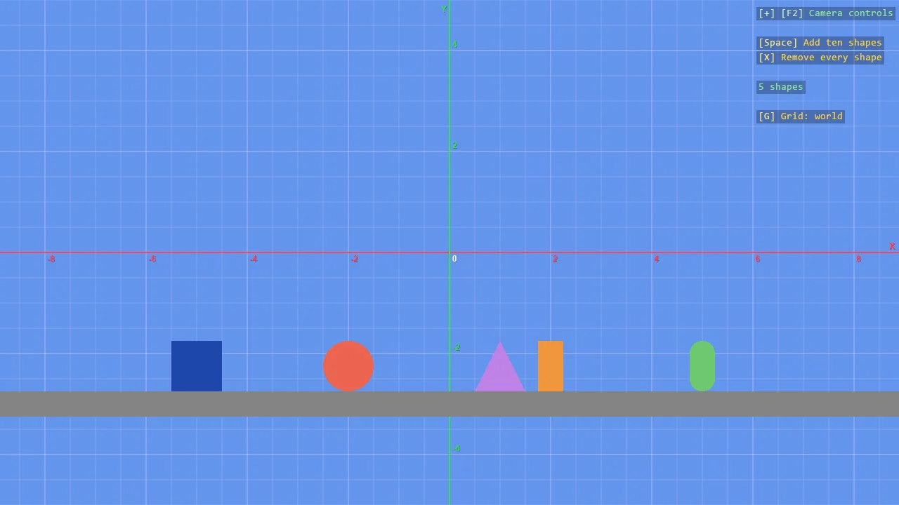
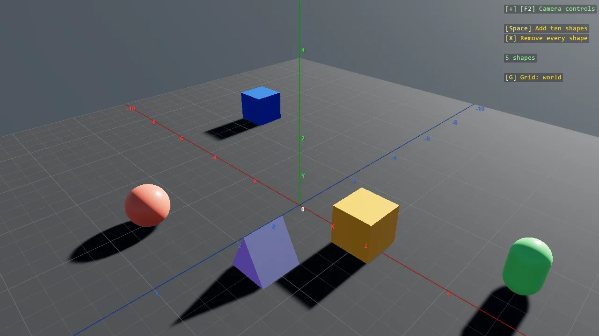
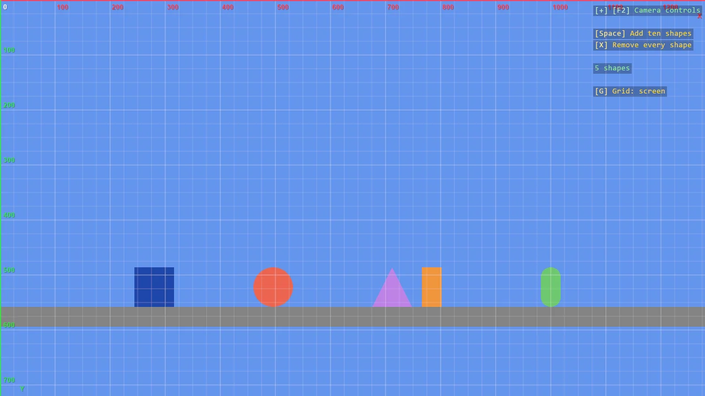

# Reference Grid

`ReferenceGrid` draws a grid with numbered lines over a scene, so you can see where things are. It shows
one of two coordinate spaces: the world, where models and physics bodies are placed, or the screen, where
a [ShapeBatch](shape-batch.md) draws with `Screen` on. It is in the `Stride.CommunityToolkit.Shapes`
package.

```csharp
var grid = game.AddGrid();
```

Call it from the Start callback, after the graphics compositor and a camera exist. The grid follows the
first camera of the compositor.

## The two spaces

| | World | Screen |
|---|---|---|
| Origin | The world's origin | The top left corner of the window |
| Unit | World units | The pixels code draws in. On a scaled display one of them is more than one pixel of the monitor |
| Y points | Up | Down |
| Used by | Entities, models, physics bodies, a `ShapeBatch` in the world | A `ShapeBatch` with `Screen` on, screen-space text |

In a base 2D scene the camera looks at the world's origin, so world `(0, 0)` is in the middle of the
window until the camera moves.

### World, 2D scene



Under an orthographic camera the grid lies in the XY plane and covers what the camera sees. Flat shapes
at Z = 0 hide the lines behind them.

### World, 3D scene



Under a perspective camera the grid lies on the ground plane XZ and covers a square around the origin,
with a short Y axis in the middle. Scene geometry hides the lines behind it.

### Screen



The screen grid counts pixels from the top left corner and is drawn over everything. Its unit is the one
`ShapeBatch` and screen-space text use, which follows the display scale: on a 150% display, 100 on the grid is
150 pixels of the monitor. The overlay line then reads "Grid: screen, 1 = 1.5 px".

> [!NOTE]
> The grid can only know the display scale in a DPI-aware process. Call `WindowsDpiManager.EnablePerMonitorV2()`
> before creating the game, as the examples do. Without it Windows stretches the whole window and the
> program is told the scale is 100%.

## Switch the grid

By default the key **G** steps through off, world and screen, and the [debug overlay](debug-overlay.md)
shows the current state. The same can be done from code.

```csharp
var grid = game.AddGrid(GridSpace.Screen, toggleKey: Keys.None);

grid.Cycle();                     // to the next state
grid.Visible = false;             // or set the state directly
grid.Space = GridSpace.World;
```

| Member | Description |
|---|---|
| `Visible` | Whether the grid is drawn |
| `Space` | `GridSpace.World` or `GridSpace.Screen` |
| `Cycle()` | Steps from hidden to world, from world to screen, from screen to hidden |
| `ToggleKey` | The key that calls `Cycle()`. `Keys.None` for no key. Defaults to `Keys.G` |

## What it draws

- Minor and major lines. The major lines are numbered.
- The axes through the origin, in Game Studio's colours: X red, Y green, Z blue, with a letter each.
- The coordinates under the mouse, in both spaces, written beside the mouse.

| Property | Default | Description |
|---|---|---|
| `ShowNumbers` | `true` | Numbers on the major lines and letters on the axes |
| `ShowCursor` | `true` | The coordinates under the mouse |
| `Plane` | `Auto` | The plane of the world grid. `Auto` takes XY under an orthographic camera and XZ under a perspective one |
| `MajorStep` | 0 | The distance between major lines in world units. 0 chooses it from the zoom |
| `MinorDivisions` | 0 | Minor steps in a major step. 0 chooses 4 or 5 so that the minor lines fall on round numbers |
| `Extent` | 20 | The side of the square the grid covers on the ground plane |
| `ScreenStep` | 100 | The distance between major lines in screen space, in pixels |
| `ScreenMinorDivisions` | 4 | Minor steps in a major step in screen space |
| `LineColor` | White | The colour of the lines that are not axes |
| `MinorOpacity`, `MajorOpacity` | 0.1, 0.25 | The opacity of the minor and the major lines |
| `FontSize` | 12 | The size of the numbers, in pixels on a 100% display |

Remarks:

- With `MajorStep` at 0, the step follows the zoom in jumps of 1, 2 and 5, so that major lines stay about
  a hundred pixels apart.
- In a 2D scene, when the camera is moved away from the origin, the numbers stay along the edge of the
  window nearest to their axis.
- On the ground plane the grid does not extend beyond `Extent`.
- The grid draws with two batches of its own. It does not become the batch that `ShapeComponent` draws
  through, and it does not change the state of any batch you created.

## See also

- [ShapeBatch](shape-batch.md)
- [Debug Overlay](debug-overlay.md)
- [Build a simple HUD with ShapeBatch](../../tutorials/rendering/shapebatch-hud.md)