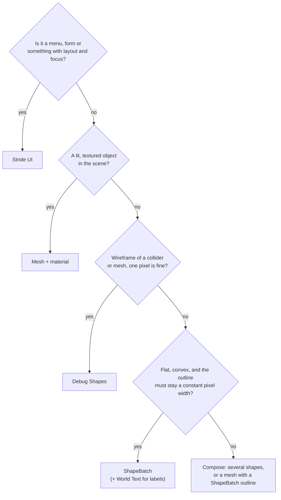
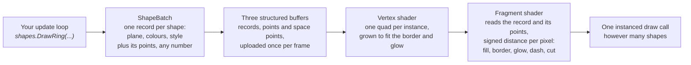

# ShapeBatch

`ShapeBatch` draws vector shapes without meshes, materials or a UI tree: discs, rings, polygons, rounded
rectangles, sectors, arcs, lines and polylines. Outlines, glows and dashes are measured in pixels, so they keep
their width at any distance or zoom. It works in 2D and 3D scenes and is in the
`Stride.CommunityToolkit.Shapes` package.

For a tour of every shape, see the [ShapeBatch example](../code-only/examples/shape-batch.md). For method
signatures, see the API reference.

> [!TIP]
> New to `ShapeBatch`? The tutorial [Build a simple HUD with ShapeBatch](../../tutorials/rendering/shapebatch-hud.md)
> goes through it in eight steps. This page is the reference.

## When to use ShapeBatch

| Tool | Use it for | Not suited for |
|---|---|---|
| Stride UI | Menus, forms and anything with layout, focus and input routing | Vector shapes. It draws textured quads |
| [Debug Shapes](debug-shapes.md) | Wireframes of colliders and meshes, one pixel wide | Anti-aliased or constant-width outlines |
| Mesh and material | Lit, textured objects in the scene | Outlines that keep a pixel width. The outline is geometry and shrinks with distance |
| `ShapeBatch` | Flat shapes with pixel-measured outlines: markers, HUD panels, gauges, selection rings, thick lines | Concave fills, text, layout |



## How it works

Each shape is drawn as one quad. For every pixel of the quad, the pixel shader computes a signed distance to the
shape's edge: negative inside, positive outside. The rest follows from that distance.

| Distance | Result |
|---|---|
| Inside by more than the border width | Fill colour |
| Inside by less than the border width | Border colour |
| Outside | Transparent, anti-aliased over the last pixel |

The border width is compared in pixels, so it is constant on screen. Rings, sectors, glows, dashes and
gradients are further functions of the same distance. A polyline is the distance to the nearest segment of a
run, which gives round joins and caps.



All shapes of a batch are drawn in one instanced draw call. The technique is based on the `solid_polygon`
shader of the Box2D testbed.

## Create a batch and draw

Create a batch once, after the graphics compositor exists. Draw from your update code every frame.

```csharp
var shapes = game.AddShapeBatch(depthTest: true);

// In Update
shapes.Fill.Set(Color.Green, 0.95f);
shapes.DrawRectangle(center, axisX, axisY, new Vector2(120 * fuel, 8), Color.Green);
shapes.DrawDisc(new Vector3(0f, 0.02f, 1.5f), Vector3.UnitY, 3f, Color.OrangeRed);
```

| `AddShapeBatch` parameter | Description |
|---|---|
| `depthTest` | `true`: scene geometry can cover the shapes. `false`: the batch draws over everything |
| `fill` | A fill source for textured shapes. See [Fill a shape with a texture or a shader](#fill-a-shape-with-a-texture-or-a-shader) |
| `afterPostEffects` | Draws the batch after the post-processing chain. See [Draw after post effects](#draw-after-post-effects) |

`ShapeBatch` is immediate mode, like `SpriteBatch`. Shapes are submitted every frame, drawn once in submission
order, and discarded. Nothing is retained between frames.

## Draw state

Style properties are the batch's current state. Each draw call captures the state at the time of the call.

| Property | Description |
|---|---|
| `BorderWidth` | Outline width in pixels |
| `Fill` | Fill colour and alpha |
| `Glow` | Halo outside the outline: width in pixels, colour, `Strength`, `Additive` |
| `Dash` | Dash pattern in pixels |
| `Gradient` | A second fill colour and a direction |
| `Opacity` | Multiplies the alpha of border, fill and glow |
| `DepthFade` | Distance in world units over which a shape fades as it approaches scene geometry |
| `Textured` | Whether the fill samples the batch's fill source |
| `Screen` | Draws in window pixels instead of world units |
| `Tag` | Marks shapes for picking |

> [!NOTE]
> State persists until you change it. A method that sets `Textured`, `Screen` or `Tag` for its own shapes must
> restore the value afterwards.

### Glow

The alpha of the glow colour sets how strong the glow is at the outline. At full alpha the glow reads as a
thicker stroke. At 30 to 40 percent it reads as light around the stroke.

- `Glow.Strength` (0 to 1) sets the strength when the glow uses each shape's own outline colour.
- `Glow.Additive` adds the glow to the scene instead of blending over it.

```csharp
shapes.Glow.Set(10f);
shapes.Glow.Strength = 0.35f;
shapes.Glow.Additive = true;
```

## Plane modes

A shape is flat and lies in a plane. The plane mode sets how the plane is oriented.

| `PlaneMode` | Plane | Use |
|---|---|---|
| `Fixed` | The two axes you pass | Discs on the ground, decals, panels on a wall |
| `Screen` | Faces the camera | Billboards that keep their shape from any angle |
| `Axial` | Keeps your X axis and turns about it to face the camera | A capsule between two points: a thick 3D line with round ends |

Pixel-measured widths are correct under perspective and orthographic cameras.

### Space strokes

`DrawPolyline` and `DrawPixelPolyline` accept `Vector3` points. A space stroke has no plane. It is measured on
screen and faces the camera from every angle.

- `DrawPolyline` uses a width in world units, which narrows with distance.
- `DrawPixelPolyline` uses a constant width in pixels.
- Each fragment writes its depth, so a stroke passes behind and in front of geometry.

### Depth fade

`DepthFade` fades a shape over the given distance, in world units, as it approaches the scene geometry behind
it. A marker on the ground blends into it instead of ending in a hard line. A value of 0 keeps the hard cut.

- In a depth-tested batch, the depth test still removes fragments behind a surface.
- In an overlay batch, fragments behind a surface fade out.
- The fade needs the resolved depth texture of the forward renderer. Without it, shapes keep the hard cut.

## Fill a shape with a texture or a shader

`ShapeBatch.FillSource` takes a Stride material node (`IComputeColor`): a texture with scale, offset and
address modes, a combination of nodes, or a shader class. Shapes drawn while `Textured` is `true` multiply their
fill by the sample.

```csharp
var pictures = game.AddShapeBatch(depthTest: true);

pictures.FillWith(texture);

var stripes = game.AddShapeBatch(depthTest: true);
var stripe = stripes.FillWith(texture, scale: new Vector2(4f, 1f), addressMode: TextureAddressMode.Wrap);

// In Update: scroll the texture
stripe.Offset = new Vector2(seconds * 0.25f, 0f);
```

Remarks:

- The texture coordinate runs from (0, 0) at the top left to (1, 1) across the shape's bounding box.
- The sample multiplies the fill colour. A white fill shows the texture unchanged.
- Border, glow and gradient work as for a plain fill.
- A batch has one fill source. `Textured` is per draw call, so one batch can hold textured and plain shapes.
- The batch reads the node every frame. Changing a node's offset, scale or texture needs no rebuild.
- To show another camera's view in a shape, fill it with the texture from `game.AddRenderTextureCamera`. See
  [Render to texture](render-to-texture.md).

### Use a shader class as the fill

A shader class that derives from `ComputeColor` can be the fill source.

```csharp
// examples/code-only/E11_3D_ShapeBatch_Gallery/Program.cs
var clock = new ComputeFloat4(Vector4.Zero);

game.AddShapeBatch(depthTest: true, fill: new ComputeShaderClassColor
{
    MixinReference = "GalleryPlasma",
    CompositionNodes = { ["Clock"] = clock },
});
```

```hlsl
// examples/code-only/E11_3D_ShapeBatch_Gallery/Effects/GalleryPlasma.sdsl
shader GalleryPlasma : ComputeColor, Texturing
{
    compose ComputeColor Clock;

    override float4 Compute()
    {
        float t = Clock.Compute().x;
        float2 p = streams.TexCoord * 7.0;
        ...
    }
};
```

Place the `.sdsl` file in the project's `Effects` folder.

> [!NOTE]
> `Global.Time` is zero in a shape batch's effect. To animate a shader fill, compose a node into the shader
> and set its value every frame, as `Clock` above.

## Draw on the screen

Set `Screen` to `true` to draw in window pixels. The origin is the top left corner and Y points down.

```csharp
shapes.DrawDisc(new Vector3(0f, 0.02f, 1.5f), Vector3.UnitY, 3f, Color.OrangeRed); // world

shapes.Screen = true;
var centre = shapes.ScreenSize * 0.5f;
shapes.DrawRing(new Vector3(centre, 0f), Vector3.UnitZ, 22f, Color.White);
shapes.DrawArc(shapes.Corner(ScreenCorner.BottomLeft) + new Vector2(100f, -90f), 50f, -MathF.PI * 0.5f, MathF.Tau * health, Color.LimeGreen, width: 14f);
shapes.Screen = false;
```

| Member | Description |
|---|---|
| `Screen` | Per-draw state. World and screen shapes can share a batch |
| `ScreenSize` | The window size in the units the batch draws in |
| `Corner(ScreenCorner)` | The position of a window corner |
| `Viewport` | A rectangle that offsets screen shapes and sizes `Corner()` |

Remarks:

- With `AutoScale` on, which is the default, units are the display's scaled pixels.
- A positive angle turns clockwise on screen.
- Screen shapes are drawn at the near plane, in front of scene geometry.
- `Viewport` positions shapes. It does not clip them.
- The `Screen` property is different from `PlaneMode.Screen`, which is a billboard in the world.

## Draw after post effects

A batch in the scene is drawn into the HDR buffer before post processing. Auto exposure and tone mapping then
apply to its colours, so `Color.White` can appear grey.

```csharp
var world = game.AddShapeBatch(depthTest: true);
var hud = game.AddShapeBatch(afterPostEffects: true);
```

| Batch | Colours | Depth test | Use |
|---|---|---|---|
| Default | Exposed and tone mapped with the scene | Optional | Markers and decals that belong to the scene |
| `afterPostEffects: true` | Written as given | None | HUD elements, crosshairs, label lines |

`afterPostEffects` requires the toolkit's UI stage in the compositor. Without it, the batch draws in the
transparent stage.

## Pick shapes

A batch can report which of its shapes is under a screen position. Shapes are tested with the same distance
functions that draw them.

```csharp
shapes.Tag = station;
shapes.DrawRing(station.Origin, Vector3.UnitY, 5.8f, Color.White);
shapes.Tag = null;

// Next frame, in Update
if (shapes.TryPick(Input.MousePosition, out var hit) && hit.Tag is Station picked)
{
    GoTo(picked);
}
```

| Member | Description |
|---|---|
| `Tag` | Per-draw state. Only shapes drawn with a tag can be picked |
| `TryPick(screenPosition, out hit, slackPixels)` | Returns the topmost tagged shape |
| `PickAll` | Returns every hit, front to back |
| `CanPick` | `false` until the batch has been drawn once |
| `ShapeComponent.Pickable` | Makes a component its own tag |

A `ShapeHit` contains the tag, the world position of the hit (pixels for a screen shape), the position in the
shape's own plane coordinates, the signed distance to the outline, and the depth.

Remarks:

- Picks are answered from the last drawn frame.
- The topmost shape is the one nearest to the camera. At equal depth it is the one drawn last. Screen shapes
  are in front of world shapes.
- The border is part of the shape. `slackPixels` extends the hit area, which helps with thin strokes.
- A ring, arc or polyline is picked on its stroke. To pick a whole area, draw a disc or rectangle with a
  transparent fill: `Fill.Set(null, 0f)`.

Limitations:

- Scene geometry does not block a pick. A depth-tested shape behind a wall can still be picked. Use
  [GPU picking](gpu-picking.md) for meshes.
- A dashed outline is picked as if it were solid.
- A batch answers for the last view that drew it.

## Text, display scale and components

- **Text.** `ShapeBatch` does not draw text. Use [World Text](world-text.md). A `WorldTextComponent` with
  `Billboard = false` lies in its entity's XY plane, so it can sit on a panel.
- **Display scale.** With `AutoScale` on, pixel values follow the display scale: 2 pixels at 100 % are 3
  pixels at 150 %. Set `AutoScale = false` to use physical pixels.
- **Components.** `ShapeComponent` draws a shape from an entity's transform and appears in Game Studio. It
  needs no `AddShapeBatch` call. If the game has a batch, the component uses it. Otherwise a depth-tested batch
  is registered automatically.

## Colour and blending

- Colours are sRGB values. The shader decodes them to linear light when the render target is linear.
- Shapes are composited with premultiplied alpha, in linear light.
- An additive glow contributes colour and no alpha.

## Limitations

- **Convex fills only.** The fill of a concave polygon is not supported. Strokes can follow any path, open or
  closed.
- **Long translucent strokes.** A run of more than 64 points is drawn in pieces. With `Opacity` below 1, the
  joint between two pieces is slightly brighter. A space stroke restarts its dash pattern at each piece.
- **Flat shapes.** Only space strokes pass through 3D points. A sphere outline is a billboard disc. Mesh
  wireframes are not supported.
- **No clipping.** `Viewport` positions and sizes screen shapes and does not clip them.
- **No text.** Use World Text, or render text to a texture and use it as a fill.
- **One fill source per batch.** Use a second batch for a second texture.
- **No layout or events.** Hover and click handling is your code, based on `TryPick`.
- **Sorting.** A batch sorts against transparent meshes as one object. Two batches in the same stage draw
  in the order they were added, the later one on top. Draw shapes that must layer in a fixed order
  through one batch, and use an overlay batch for shapes that must never be covered.

## Example: an in-scene console

The SignalR example (`E13_SignalR/Station/`) builds a console in the scene from `ShapeBatch` calls.

| Part | Implementation | Feature |
|---|---|---|
| `Board` | A plane in the world with (u, v) coordinates | `PlaneMode.Fixed` |
| `StationBoard.Draw` | Panel, rail, dividers, buttons and bars, drawn every frame | Immediate mode, draw state |
| Scheme buttons | A solid `Fill` for the selected one, a `Glow` for the hovered one | Fill and glow |
| `DrawCornerTicks` | A quarter `DrawArc` and two `DrawPixelLine` calls per corner | Arcs, pixel strokes |
| `Labels` | World text entities with the board's rotation | World Text |
| `DeckEffects` rings | `DrawRing` with a fading `Opacity` and a growing radius | Opacity |
| Starfield | 400 `DrawBillboardCircle` calls in the same batch | `PlaneMode.Screen` |

## See also

- [ShapeBatch example](../code-only/examples/shape-batch.md)
- [Reference Grid](reference-grid.md)
- [World Text](world-text.md)
- [Render to texture](render-to-texture.md)
- [GPU picking](gpu-picking.md)
- [Debug Shapes](debug-shapes.md)
- [Shaders in a toolkit package](../../contributing/toolkit/shaders.md)