# TextureCanvas

## Introduction

The `TextureCanvas` is a utility class allowing dynamic creation of textures at runtime. Acting as a wrapper around the `Texture` class, it provides a simpler API for simple texture manipulation.

## Motivation
Stride is a very versatile and powerful engine which uses textures for a lot of data processing.
Sometimes it is necessary to create these textures on the fly for example for simple tasks like scaling, applying image effects or to build new textures based on existing ones (texture atlas).

## `TextureCanvas`
The @Stride.CommunityToolkit.Rendering.Utilities.TextureCanvas abstracts away a lot of complexity behind custom buffers, textures, memory allocation and instead
provides you with a simpler builder API to define your texture dynamically.

```csharp
var renderContext = RenderContext.GetShared(game.Services);
using var canvas = new TextureCanvas(renderContext);
```

> [!NOTE]
> Notice the `using` at the front. This part is crucial as you should always dispose of your texture canvas when it's no longer needed. The canvas utilizes multiple image buffers behind the scenes, and failing to dispose of it prevents the release of these resources, which can lead to memory leaks.

## Initialization
Most operations start with a single texture as a source so we need to load the texture first using the traditional texture api.

```csharp
var directory = Path.GetDirectoryName(Assembly.GetEntryAssembly()!.Location)!;
var filePath = Path.Combine(directory, "input.png");

using var input = File.Open(filePath, FileMode.Open);
var texture = Texture.Load(game.GraphicsDevice, input);
```

This code loads an input image from the local file system and stores it as a temporary texture

## Loading
In case you just want to manipulate a texture directly you can also use the similar api from the `TextureCanvas` directly.

```csharp
var directory = Path.GetDirectoryName(Assembly.GetEntryAssembly()!.Location)!;
var filePath = Path.Combine(directory, "input.png");
canvas.Load(filePath)
```
This would load the same texture directly as a buffer for further processing.
Similar methods also exist for file streams or data buffers accordingly.

## Storing
To get the resulting image you have the option to save the image to a file, stream or array depending on your requirements.

```csharp
var directory = Path.GetDirectoryName(Assembly.GetEntryAssembly()!.Location)!;
var filePath = Path.Combine(directory, "input.png");
using var output = File.Open(filePath, FileMode.Open);
canvas.Store(output, ImageFileType.Png);
```

The most common approach however would be to get the result as a texture you can use for your UI or Materials.
```csharp
var output = canvas.ToTexture();
```

> [!NOTE]
> Notice that you shouldn't use these methods every frame as it involves GPU < - > CPU transfers which can block your game.

## Manipulation
The `TextureCanvas` supports various image manipulations as well as image effects.

### Resample
The **Resample** method changes the current size of the texture or pixel format while preserving the current content.
The content will be resized to match the new size if neccesary.
```csharp
canvas.Resample(size: new Size2(512, 512), pixelFormat: PixelFormat.R8G8B8A8_UNorm)
```

### BrightFilter
The **BrightFilter** method a @Stride.Rendering.Images.BrightFilter filter to the image

```csharp
canvas.BrightFilter(threshold: 0.2f, steepness: 1.0f)
```

### GaussianBlur
The **GaussianBlur** method applies a @Stride.Rendering.Images.GaussianBlur effect to the image

```csharp
canvas.GaussianBlur(radius: 4, sigmaRatio: 2.0f)
```

### CoCMapBlur
The **CoCMapBlur** method applies a @Stride.Rendering.Images.CoCMapBlur effect to the image
```csharp
canvas.CoCMapBlur(radius: 4)
```

### Transform
The **Transform** method applies a @Stride.Rendering.Images.ColorTransformGroup effect to the image

```csharp
canvas.Transform(transforms: new[] { new LuminanceToChannelTransform{ ColorChannel = ColorChannel.R } })
```

### Combine
The **Combine** method applies a @Stride.Rendering.Images.ColorCombiner effect to the image

```csharp
canvas.Combine(
   textures: new [] { sourceTexture1, sourceTexture2, null /* = Canvas Content */ },
   factors: new [] { .2f, .2f, .6f }
);
```

### Colorize
The **Colorize** method multiplies the current canvas content by a color to create a modulated image.

```csharp
canvas.Colorize(colorMultiplier: new Color4(1f, 0, 0));
```

### Recolorize
The **Recolorize** method works the same way as colorize but only uses the red-channel as an input.
The color multiplier is optional, omitting it would change the image to a gray-scale image.

```csharp
canvas.Recolorize(colorMultiplier: new Color4(1f, 0, 0));
```

### Apply
The **Apply** method applies a custom @Stride.Rendering.Images.ImageEffect to the image

```csharp
using var effect = new GaussianBlur();
canvas.Apply(effect);
```

## Drawing
Sometimes you also want to customize which parts of a source texture is applied to which part of the canvas.
You can also compose multiple texture into a single one using these methods.

### Stretch
This enum controls the stretch mode when resampling the source rect to the target rect

- **None:**
The texture preserves its original size. Overflowing content is cropped.
- **Stretch:**
The texture is resized to fill the destination dimensions.
The aspect ratio is not preserved.
- **Contain:**
The texture is resized to fit in the destination dimensions while it preserves its native aspect ratio.
- **Cover:**
The texture is resized to fill the destination dimensions while it preserves its native aspect ratio.
If the aspect ratio of the destination rectangle differs from the source,
the source texture is clipped to fit in the destination dimensions.

### Anchors
This enum controls the alignment mode if clipping or padding is necessary.
How the anchors behave is dependant on the selected stretch mode.

- **TopLeft:**
  Adjust the position so the top-left corner of the source and target rect are aligned.
- **Top:**
  Adjust the position so the top-edge center of the source and target rect are aligned.
- **TopRight:**
  Adjust the position so the top-right corner of the source and target rect are aligned.
- **Left:**
  Adjust the position so the left-edge center of the source and target rect are aligned.
- **Center:**
  Adjust the position so the center of the source and target rect are aligned.
- **Right:**
  Adjust the position so the right-edge center of the source and target rect are aligned.
- **BottomLeft:**
  Adjust the position so the bottom-left corner of the source and target rect are aligned.
- **Bottom:**
  Adjust the position so the bottom-edge center of the source and target rect are aligned.
- **BottomRight:**
  Adjust the position so the bottom-right corner of the source and target rect are aligned.

### Draw
There are many overloads to the draw method but all of them follow this basic structure.

```csharp
canvas.DrawTexture(
    texture,
    [SourceRect],
    [TargetRect],
    [ColorMultiplier],
    [Stretch],
    [Anchor],
    [SamplingPattern]
);
```

> [!NOTE]
> Notice the options for stretch and anchors these control how the texture is converted from the source rectangle to the target one.

#### Examples
| Stretch | Anchor      | Source Rect           | Target Rect             | Result                       |
|---------|-------------|-----------------------|-------------------------|-----------------------------------|
| None    | TopLeft     | 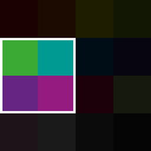 | 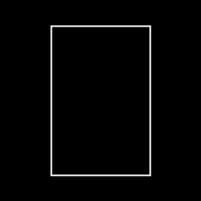 |       |
| None    | Top         |  |  | 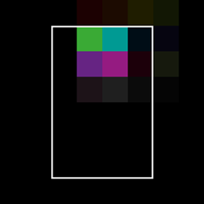    |
| None    | TopRight    |  |  |      |
| None    | Left        |  |  | 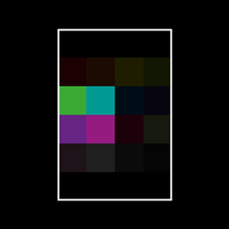   |
| None    | Center      |  |  | 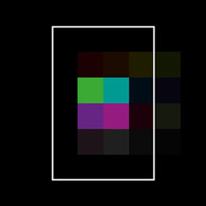 |
| None    | Right       |  |  | 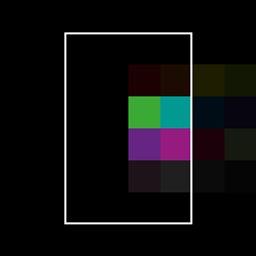  |
| None    | BottomLeft  |  |  | 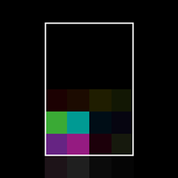   |
| None    | Bottom      |  |  | 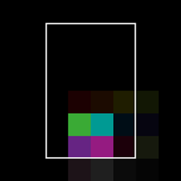 |
| None    | BottomRight |  |  |   |
| Stretch | Any         |  |  | 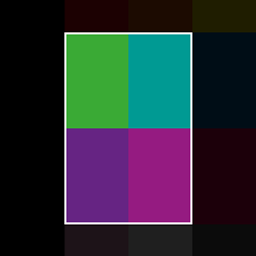      |
| Stretch | Any         |  |  |       |
| Contain | AnyLeft     |  |  | 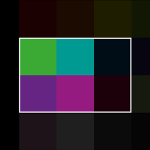       |
| Contain | AnyRight    |  |  |       |
| Contain | AnyTop      |  |  | 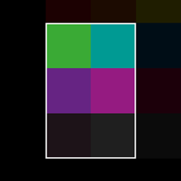        |
| Contain | AnyBottom   |  |  | 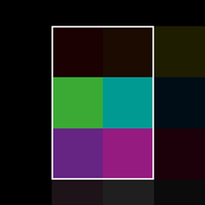     |
| Contain | AnyCenter   |  | 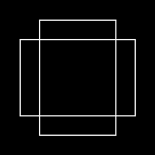   | 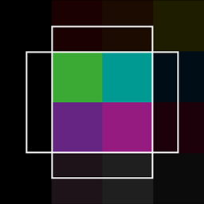     |
| Cover   | AnyLeft     |  |  | 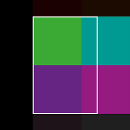         |
| Cover   | AnyRight    |  |  |         |
| Cover   | AnyTop      |  |  | 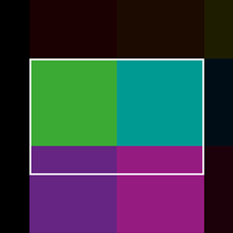          |
| Cover   | AnyBottom   |  |  | 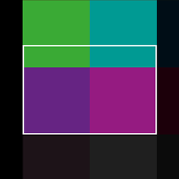       |
| Cover   | AnyCenter   |  |    |        |

View on [GitHub](https://github.com/stride3d/stride-community-toolkit/tree/main/examples/code-only/Example06_ImageProcessing).

[!code-csharp[](../../../examples/code-only/Example06_ImageProcessing/Program.cs)]