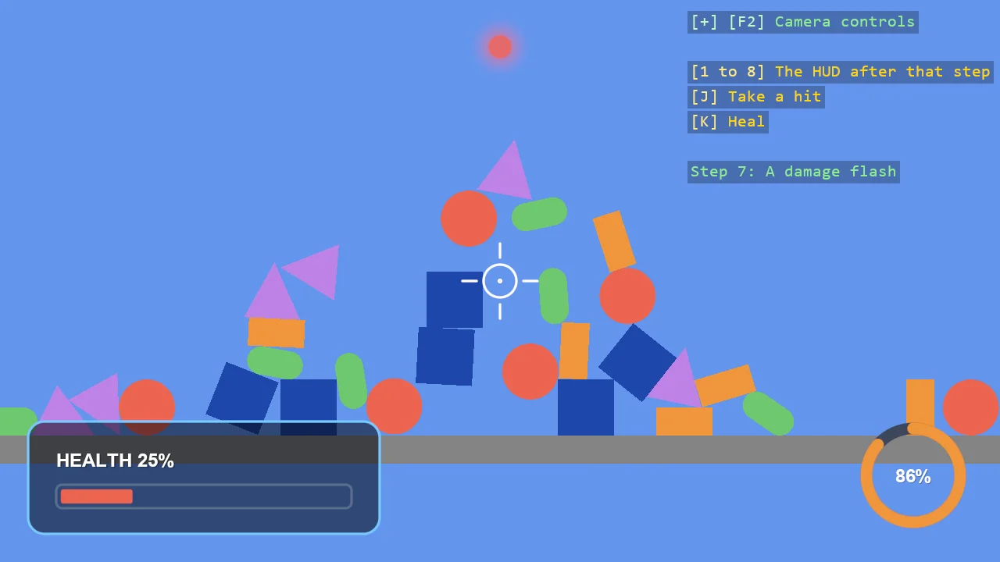
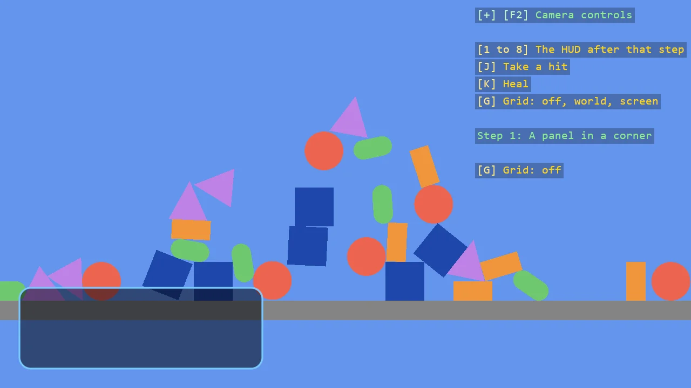
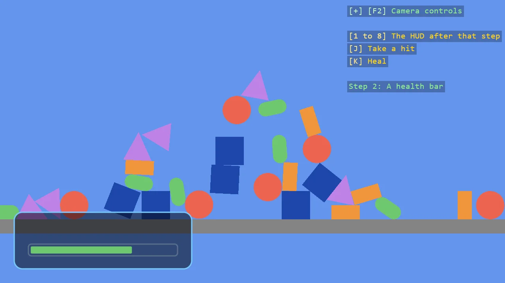
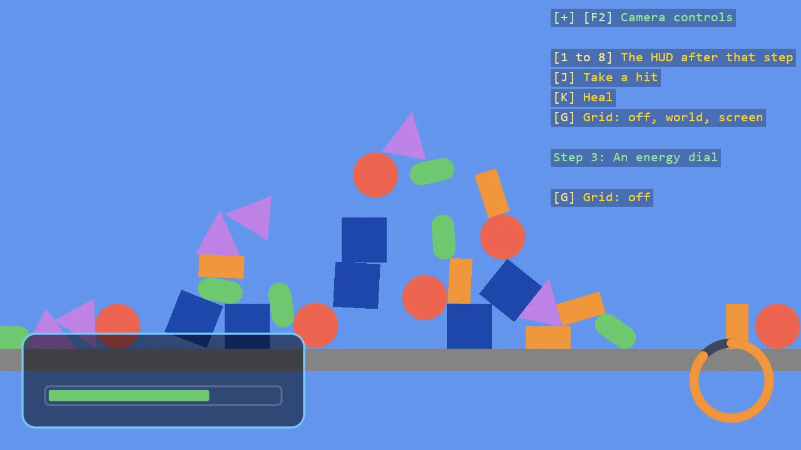
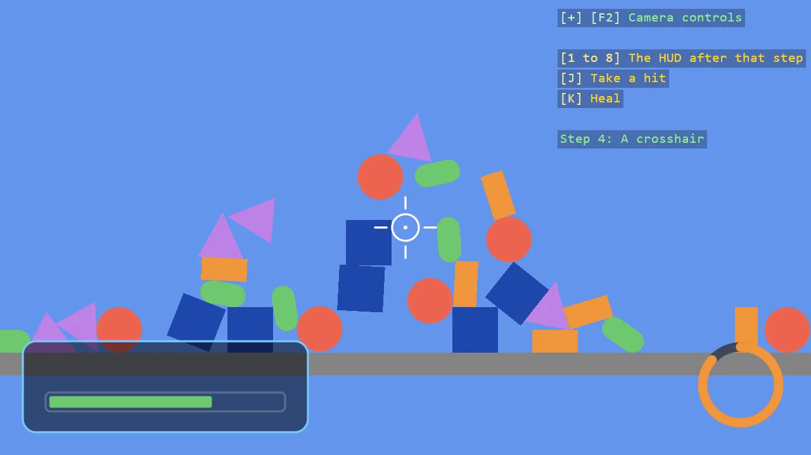
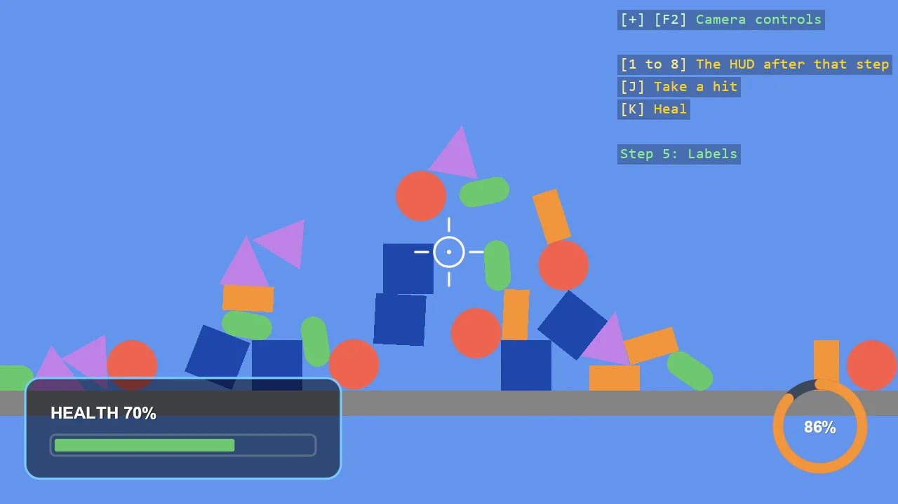
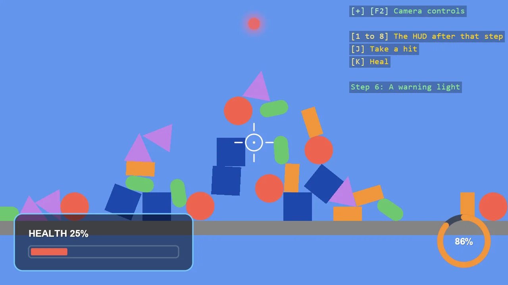
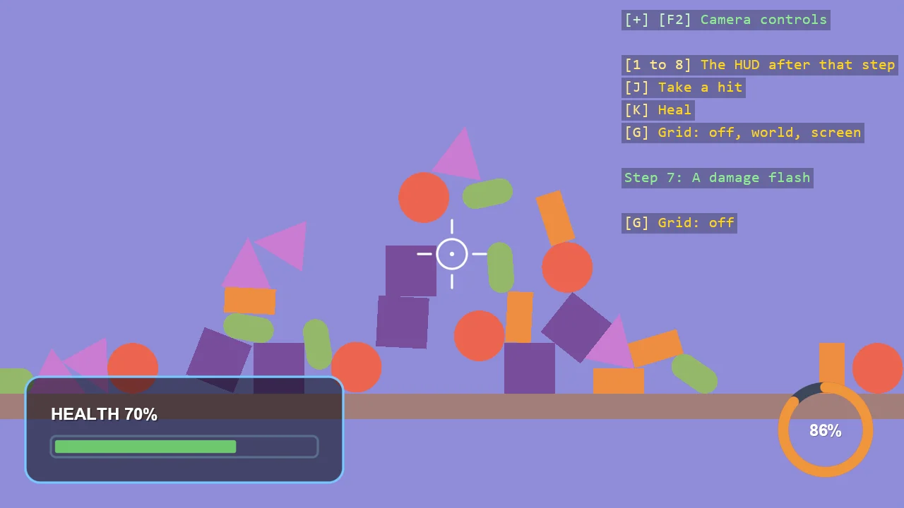

# Build a simple HUD with ShapeBatch

**Level:** Beginner

In this tutorial you draw a HUD over a running game, one piece at a time: a panel, a health bar, an
energy dial, a crosshair, labels, a warning panel and a damage flash. Each step adds a few lines and
one idea. The last step moves the finished HUD out of `Program.cs` into files of its own.



You will learn how to:

- Draw shapes on the screen, in pixels, anchored to a corner of the window.
- Control a shape's outline and fill.
- Redraw a shape from a value every frame, so it always shows the current state of the game.
- Draw arcs, rings and lines.
- Add text beside shapes.
- Use glow and opacity.
- Layer shapes by the order in which you draw them.
- Organise a HUD as a class.

This is the first part. It only draws. A later part turns it into a small game.

The finished program is the example
[HUD Basics (Step by Step)](../../manual/code-only/examples/hud-basics.md). You do not need it to
follow the steps, but it is there if you want to compare.

## Before you start

1. Follow [Create Project](../../manual/code-only/create-project.md) to create a console project with
   the toolkit.
2. Add the shapes package:

   ```
   dotnet add package Stride.CommunityToolkit.Shapes --prerelease
   ```

3. Replace the code in `Program.cs` with the program of
   [Basic 2D Scene (Falling Shapes)](../../manual/code-only/examples/falling-shapes-2d.md). A HUD sits
   over a game, and these thirty falling shapes are the game:

   ```csharp
   using Stride.CommunityToolkit.Bepu;
   using Stride.CommunityToolkit.Engine;
   using Stride.CommunityToolkit.Rendering.ProceduralModels;
   using Stride.Core.Mathematics;
   using Stride.Engine;

   const int ShapeCount = 30;

   // The shapes to drop, and the colour of each
   (Primitive2DModelType Type, Color Colour)[] shapes =
   [
       (Primitive2DModelType.Square, new Color(30, 70, 170)),
       (Primitive2DModelType.Rectangle, new Color(240, 150, 60)),
       (Primitive2DModelType.Circle, new Color(235, 100, 80)),
       (Primitive2DModelType.Capsule, new Color(110, 200, 110)),
       (Primitive2DModelType.Triangle, new Color(190, 130, 230)),
   ];

   using var game = new Game();

   game.Run(start: Start);

   void Start(Scene rootScene)
   {
       game.SetupBase2DScene();

       for (var i = 0; i < ShapeCount; i++)
       {
           // Each kind of shape in turn
           var (type, colour) = shapes[i % shapes.Length];

           var entity = game.Create2DPrimitive(type, new()
           {
               Material = game.CreateFlatMaterial(colour)
           });

           // One above the other, each a little to one side, so the column topples into a pile
           entity.Transform.Position = new Vector3(0.1f * (i % 3 - 1), 8 + i * 1.5f, 0);
           entity.Scene = rootScene;
       }
   }
   ```

4. Run it. The shapes fall into a pile.

The program has a `Start` function, which runs once and builds the scene. The HUD needs a second
function, `Update`, which runs every frame. You add it in step 1.

## Step 1: A panel in a corner

### Prepare the program

Add this line at the very top of `Program.cs`, below the `using` lines:

```csharp
WindowsDpiManager.EnablePerMonitorV2();
```

It tells Windows that the game draws for the display's real pixels. Without it, on a display scaled
to 150%, Windows stretches the whole window and the HUD's edges turn blurry. It needs
`using Stride.CommunityToolkit.Windows;`.

`ShapeBatch` draws shapes: rectangles, discs, rings, arcs and lines. Add a variable for it at the
top of the file, above `using var game = new Game();`. The program already has an array called
`shapes`, so call it `shapeBatch`:

```csharp
ShapeBatch shapeBatch = null!;
```

It needs `using Stride.CommunityToolkit.Shapes;`. The `null!` says that the value is set later, in
`Start`. Add two lines to `Start`, after `game.SetupBase2DScene();`:

[!code-csharp[](../../../examples/code-only/E03_2D_HUD_Basics/Program.cs#Step1Create)]

```csharp
// A grid with numbered lines. G switches it between world units and screen pixels
game.AddGrid();
```

The panel needs a few values. Put them at the top of the file, next to `shapeBatch`:

[!code-csharp[](../../../examples/code-only/E03_2D_HUD_Basics/Program.cs#Step1Values)]

### Draw a rectangle

A HUD is drawn every frame, so the drawing goes in an `Update` function. Tell `game.Run` about it:

```csharp
game.Run(start: Start, update: Update);
```

Then add the function at the end of the file. It needs `using Stride.Games;`.

```csharp
void Update(Scene scene, GameTime time)
{
    shapeBatch.DrawRectangle(Vector2.Zero, panelSize, panelEdge);
}
```

Run it. The whole window turns light blue. The rectangle is there, but in the world: 300 by 100
world units, centred on the world's origin, while the camera sees about 10 units from top to
bottom. You are looking at the inside of it. Zoom out with the mouse wheel to find its edges.

A HUD belongs on the screen, not in the world. Change `Update` to:

```csharp
void Update(Scene scene, GameTime time)
{
    shapeBatch.Screen = true;
    shapeBatch.DrawRectangle(Vector2.Zero, panelSize, panelEdge);
    shapeBatch.Screen = false;
}
```

Run it again. Now the rectangle is 300 by 100 pixels, but only one quarter of it shows, in the top
left corner. Press **G** to switch the grid to screen pixels: (0, 0) is the top left corner, and the
rectangle's centre is there.

### Move it into the corner

A rectangle is placed by its centre. To put it in the bottom left corner, start from that corner and
move the centre right by half the width and up by half the height. Then add a margin, so the panel
does not touch the edges:

```csharp
void Update(Scene scene, GameTime time)
{
    // Move the rectangle half its width to the right
    var panelX = panelSize.X * 0.5f;

    // Move it half its height up, because the corner it starts from is at the bottom
    var panelY = -panelSize.Y * 0.5f;

    // Start from the bottom left corner, and keep a margin from the window's edges
    var panelCentre = shapeBatch.Corner(ScreenCorner.BottomLeft) + new Vector2(panelX, panelY) + new Vector2(Margin, -Margin);

    shapeBatch.Screen = true;
    shapeBatch.DrawRectangle(panelCentre, panelSize, panelEdge);
    shapeBatch.Screen = false;
}
```

On the screen, Y points down, so "up" is a minus.

### Give it a fill and round corners

So far the rectangle is solid light blue. A panel is a dark inside with a light edge:

```csharp
    shapeBatch.Screen = true;
    shapeBatch.BorderWidth = 2f;
    shapeBatch.Fill.Set(panelFill, 0.8f);
    shapeBatch.DrawRectangle(panelCentre, panelSize, panelEdge, cornerRadius: 14f);
    shapeBatch.Screen = false;
```

### Tidy up

The next steps place things relative to the panel, so its centre gets a function of its own, and
the drawing gets one too. Move them out of `Update`:

[!code-csharp[](../../../examples/code-only/E03_2D_HUD_Basics/Program.cs#Step1)]

`Update` keeps only the two `Screen` lines and the call:

```csharp
void Update(Scene scene, GameTime time)
{
    shapeBatch.Screen = true;

    DrawPanel();

    shapeBatch.Screen = false;
}
```



What to notice:

- **Pixels.** With `Screen` set to `true`, positions and sizes are window pixels. The origin is the top
  left corner and Y points down, which is why the panel's offset from the bottom corner has a minus.
- **`Screen` stays set.** It is a setting of the batch, not of one draw call. Everything drawn while it
  is `true` is in pixels, which is why `Update` sets it back to `false` at the end.
- **A corner and an offset.** `Corner(ScreenCorner.BottomLeft)` is asked for every frame, so the panel
  stays in its corner when the window is resized. Try it.
- **Outline and fill.** Every shape is an outline and a fill. The outline takes the colour you pass
  to the draw call. `BorderWidth` sets how wide it is, and `Fill` sets what is inside: here a colour of
  its own, at 80% so the scene shows through. Left at its default, the fill is the outline's colour at
  full strength, which draws a solid shape.
- **After the post effects.** `afterPostEffects: true` draws the batch after the scene has been tone
  mapped, so the colours you write are the colours you get.

More: [Create a batch and draw](../../manual/rendering/shape-batch.md#create-a-batch-and-draw),
[Draw on the screen](../../manual/rendering/shape-batch.md#draw-on-the-screen),
[Draw after post effects](../../manual/rendering/shape-batch.md#draw-after-post-effects),
[Reference Grid](../../manual/rendering/reference-grid.md).

## Step 2: A health bar

The bar is two rectangles: a track that is an outline, and a bar inside it whose width is the health.

Add the values at the top of the file:

[!code-csharp[](../../../examples/code-only/E03_2D_HUD_Basics/Program.cs#Step2Values)]

Add two keys at the top of `Update`, so there is a health to watch change. They need
`using Stride.Input;`.

[!code-csharp[](../../../examples/code-only/E03_2D_HUD_Basics/Program.cs#Step2Update)]

A HUD is mostly made of two kinds of shape: outlines with nothing inside, and solid shapes with no
outline. The bar uses both, and so do the dial and the crosshair later. Each kind is a
`BorderWidth` and a `Fill`, so give each its own small function.

`Outline` sets an outline of 2 pixels and an empty inside:

[!code-csharp[](../../../examples/code-only/E03_2D_HUD_Basics/Program.cs#Step2Outline)]

`Solid` sets no outline and fills the shape with the colour of its draw call:

[!code-csharp[](../../../examples/code-only/E03_2D_HUD_Basics/Program.cs#Step2Solid)]

Then the bar. The track is drawn after `Outline()`, the bar after `Solid()`:

[!code-csharp[](../../../examples/code-only/E03_2D_HUD_Basics/Program.cs#Step2)]

Add `DrawHealthBar();` after `DrawPanel();`.



What to notice:

- **Nothing is stored.** The batch keeps no shapes between frames. Every frame you draw the bar again,
  as wide as the health is at that moment. That is why there is no code to "update" the bar: press
  **J** and **K** and it follows.
- **The state is set before the draw call.** `BorderWidth` and `Fill` are settings of the batch. A draw
  call takes them as they are at that moment. `Outline()` and `Solid()` are just names for the two
  settings used most.
- **`Fill.Set(null, ...)`.** A fill colour of `null` means "the colour of the draw call". The second
  value is the strength: 0 leaves the shape empty, 1 fills it.

More: [How it works](../../manual/rendering/shape-batch.md#how-it-works),
[Outline and fill](../../manual/rendering/shape-batch.md#outline-and-fill).

## Step 3: An energy dial

A second value, shown as a ring that fills clockwise, in the opposite corner.

Add these values at the top of the file:

[!code-csharp[](../../../examples/code-only/E03_2D_HUD_Basics/Program.cs#Step3Values)]

The game has no energy yet, so `Update` makes one that moves by itself. Add this right below the
keys:

[!code-csharp[](../../../examples/code-only/E03_2D_HUD_Basics/Program.cs#Step3Update)]

The dial is two arcs: the whole circle in a dim colour, and over it the part that is full.

[!code-csharp[](../../../examples/code-only/E03_2D_HUD_Basics/Program.cs#Step3)]

Add `DrawEnergyDial();` after `DrawHealthBar();`.



What to notice:

- **Angles.** An arc takes a start angle and a sweep, in radians. Zero points right and a positive
  angle turns clockwise, so `-MathF.PI * 0.5f` is the top. `MathF.Tau` is a full turn.
- **An arc is a band.** Its last argument is the band's width. The band is filled like any other
  shape, which is why the function starts with `Solid()`.
- **Set what you need.** The state stays as the last piece left it. Here the bar happened to leave
  `Solid()` behind, and the dial would look right without its own call. It would also break the day
  you draw something else in between. Each piece sets its own state.

More: [Draw on the screen](../../manual/rendering/shape-batch.md#draw-on-the-screen).

## Step 4: A crosshair

A ring, four ticks and a dot, in the middle of the window.

[!code-csharp[](../../../examples/code-only/E03_2D_HUD_Basics/Program.cs#Step4)]

Add `DrawCrosshair();` after `DrawEnergyDial();`.



What to notice:

- **`ScreenSize`.** Half of it is the middle of the window, whatever the window's size.
- **A ring is the outline of a disc.** `Outline()` gives it a width of 2 pixels and nothing inside.
- **Pixel lines.** `DrawPixelLine` takes two ends and a width in pixels.
- **Sharp at any size.** The shapes are computed per pixel, not built from triangles, so a 2 pixel
  ring has a smooth edge.

## Step 5: Labels

`ShapeBatch` does not draw text. Text comes from a component, `EntityTextComponent`, placed at a
position on the screen. It needs `using Stride.CommunityToolkit.Rendering.Text;`, and the numbers
below need `using System.Globalization;`.

Add the two labels at the top of the file, next to `shapeBatch`:

```csharp
EntityTextComponent healthLabel = null!;
EntityTextComponent energyLabel = null!;
```

Register the text renderer and make the labels in `Start`:

[!code-csharp[](../../../examples/code-only/E03_2D_HUD_Basics/Program.cs#Step5Create)]

`AddLabel` creates a label, and `UpdateLabels` writes its text and moves it:

[!code-csharp[](../../../examples/code-only/E03_2D_HUD_Basics/Program.cs#Step5)]

Add `UpdateLabels();` after `DrawCrosshair();`.



What to notice:

- **A label is kept, a shape is not.** A shape exists for one frame: stop drawing it and it is gone.
  A label is an entity in the scene: it stays until you change or remove it. So labels are made once
  and then only rewritten.
- **The same pixels.** `ScreenPosition` uses the same coordinates as the shapes, so the label is
  placed from `PanelCentre()` like the bar under it.
- **Anchors.** `TextAnchor.BottomLeft` puts the position at the text's bottom left corner, so the
  label sits on a line above the bar. `MiddleCenter` centres the number in the dial.

More: [Text, display scale and components](../../manual/rendering/shape-batch.md#text-display-scale-and-components),
[Entity Text](../../manual/rendering/entity-text.md).

## Step 6: A warning panel

A second panel at the top of the window, with the word WARNING in red. It appears when the health
is low, glows, and pulses.

Add its size at the top of the file, and a third label next to the other two:

[!code-csharp[](../../../examples/code-only/E03_2D_HUD_Basics/Program.cs#Step6Values)]

```csharp
EntityTextComponent warningLabel = null!;
```

Make the label in `Start`, after the other two:

[!code-csharp[](../../../examples/code-only/E03_2D_HUD_Basics/Program.cs#Step6Create)]

Then the drawing:

[!code-csharp[](../../../examples/code-only/E03_2D_HUD_Basics/Program.cs#Step6)]

Add `DrawWarning(seconds);` after `UpdateLabels();`. `seconds` is the game's total time, from step 3.

Press **J** until the bar turns red.



What to notice:

- **Glow.** `Glow.Set(18f)` adds a halo 18 pixels wide outside the shape, in the colour of its
  outline. `Glow.Strength` sets how strong it is.
- **Opacity.** `Opacity` multiplies the transparency of everything a draw call draws: outline, fill
  and glow. Driving it with a sine of the time makes the panel pulse. The label's own `Opacity`
  pulses with it.
- **Put the state back.** Glow and opacity stay set like every other state. If the function did not
  clear them, next frame's panel would glow and pulse too. `Outline()` and `Solid()` do not touch
  them, so the function that sets them clears them.
- **Hiding a shape and hiding a label.** When the health is fine, the function returns before it
  draws, and the panel is gone. The label is an entity, so it has to be hidden: that is the first
  line of the function.

More: [Glow](../../manual/rendering/shape-batch.md#glow).

## Step 7: A damage flash

When a hit lands, the whole window flashes red and fades.

Add a value for how strong the flash is:

[!code-csharp[](../../../examples/code-only/E03_2D_HUD_Basics/Program.cs#Step7Values)]

Start it on a hit and fade it, in `Update`, below the energy:

[!code-csharp[](../../../examples/code-only/E03_2D_HUD_Basics/Program.cs#Step7Update)]

Draw it as one rectangle the size of the window:

[!code-csharp[](../../../examples/code-only/E03_2D_HUD_Basics/Program.cs#Step7)]

This call does not go at the end. It goes first. The drawing in `Update` is now:

```csharp
shapeBatch.Screen = true;

// Shapes are drawn in the order they are submitted, so what comes first lies underneath
DrawDamageFlash();
DrawPanel();
DrawHealthBar();
DrawEnergyDial();
DrawCrosshair();
UpdateLabels();
DrawWarning(seconds);

shapeBatch.Screen = false;
```

Press **J** to take a hit.



What to notice:

- **Order is depth.** Shapes are drawn in the order you submit them. The flash is submitted first,
  so the panels, the dial and the crosshair are drawn over it and stay clear.
- **A value that fades.** The flash is one number that a hit sets to 1 and time takes back to 0.
  The drawing only reads it.

## Step 8: Move the HUD into its own files

The HUD is finished. `Program.cs` now holds four things: the values, the keys, the game's numbers
and the drawing. That is fine for learning and awkward for a game, where the HUD should be something
you create and call. This step moves it out. Nothing about the drawing changes.

**The values go into a style.** The sizes and colours from the top of `Program.cs` become properties
of one class, `HudStyle.cs`:

[!code-csharp[](../../../examples/code-only/E03_2D_HUD_Basics/HudStyle.cs)]

**The drawing goes into a class.** `SimpleHud.cs` takes the batch and a style, keeps the labels, and
offers three numbers to set and one method to call:

[!code-csharp[](../../../examples/code-only/E03_2D_HUD_Basics/SimpleHud.cs#Step8Class)]

The rest of the class is the functions from steps 1 to 7, moved as they are. The only difference is
where values come from: `panelSize` is now `_style.PanelSize`, and `health` is the `Health` property.
See the whole file in the [example](../../manual/code-only/examples/hud-basics.md).

**`Program.cs` creates it and calls it.** In `Start`:

[!code-csharp[](../../../examples/code-only/E03_2D_HUD_Basics/Program.cs#Step8Create)]

In `Update`, in place of the drawing:

[!code-csharp[](../../../examples/code-only/E03_2D_HUD_Basics/Program.cs#Step8Update)]

What to notice:

- **The HUD does not know about the game.** It has no keys and no idea how health is worked out. The
  game sets three numbers and the HUD shows them. That is what lets you move it to another game.
- **A second look is a second style.** `new HudStyle { PanelEdge = Color.Orange }` gives a HUD with an
  orange edge, without touching the drawing.
- **One piece per method.** Each part of the HUD is still one small method. A larger HUD goes one
  step further and gives each part its own class and file, as the full example below does.

## The finished program

The example [HUD Basics (Step by Step)](../../manual/code-only/examples/hud-basics.md) is the whole
program. From a clone of the repository:

```
dotnet run --project examples/code-only/E03_2D_HUD_Basics
```

It can show the HUD as it stood after each step: press **1** to **7**. Press **8** for the HUD drawn
by the class from step 8; the picture is the same as at step 7.

| Key | Action |
|---|---|
| 1 to 8 | Show the HUD as it stands after that step |
| J | Take a hit |
| K | Heal |
| G | Grid: off, world units, screen pixels |

## Where next

- [ShapeBatch](../../manual/rendering/shape-batch.md), the reference for everything used here and
  for what this part left out: dashes, gradients, textured fills, shapes in the world.
- [ShapeBatch gallery](../../manual/code-only/examples/shape-batch.md), every feature as a station you can walk up to.
- [Ship HUD](../../manual/code-only/examples/hud.md), a full HUD in the same style: one widget per file,
  colour schemes, and panels that answer the mouse.